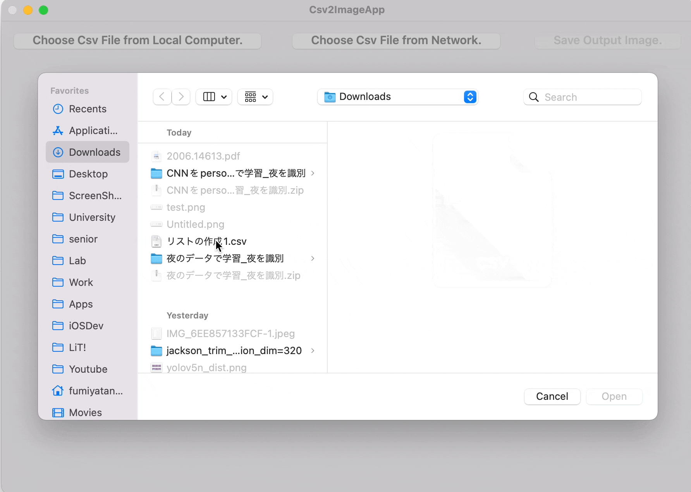

# Csv2ImageApp

Convert Csv into png image.

- App is distributed on App Store, [let's visit !](https://apps.apple.com/jp/app/csv2imageapp/id1628273936?l=en&mt=12)

## MacOS App

### Demo

- Import Csv file from local computer.



- Import Csv file from network resource.


### iOS App

- export output image by sharing (like `Airdrop`, saving to `File` and so on).


# Csv2Img (Library)

Convert Csv into png image.

- [documentation](https://fummicc1.github.io/csv2img/Csv2Img/index.html)

## Usage

You cloud convert csv into image in 3 ways.

1. Via raw `String`.

```swift
 let rawCsv = """
 a,b,c
 1,2,3
 4,5,6
 7,8,9
 10,11,12
 """
let csv = Csv.fromString(rawCsv)
let image = csv.cgImage(fontSize: 12)
// or directly get data.
let data = csv.pngData(fontSize: 12)
 Output:
 | a  | b  | c  |
 | 1  | 2  | 3  |
 | 4  | 5  | 6  |
 | 7  | 8  | 9  |
 | 10 | 11 | 12 |
```

2. Via Local file.

```swift
 let rawCsv = """
 a,b,c
 1,2,3
 4,5,6
 7,8,9
 10,11,12
 """
let url = URL(
    fileURLWithPath: "/Users/fumiyatanaka/Downloads/sample.csv"
)
rawCsv.data(using: .utf8)?.write(to: url)
// ----- ↑Just prepared for explanation. -----
let csv = Csv.fromFile(url)
let data = csv.pngData(fontSize: 12)
 Output:
 | a  | b  | c  |
 | 1  | 2  | 3  |
 | 4  | 5  | 6  |
 | 7  | 8  | 9  |
 | 10 | 11 | 12 |
```

3. Via network resource

```swift
let rawCsv = """
 a,b,c
 1,2,3
 4,5,6
 7,8,9
 10,11,12
 """
let url = URL(
    string: "https://raw.githubusercontent.com/fummicc1/csv2img/main/Fixtures/sample_1.csv"
)
// ----- ↑Just prepared for explanation. -----
let csv = Csv.fromURL(url)
let data = csv.pngData(fontSize: 12)
 Output:
 | a  | b  | c  |
 | 1  | 2  | 3  |
 | 4  | 5  | 6  |
 | 7  | 8  | 9  |
 | 10 | 11 | 12 |
```

# Csv2ImgCmd (CLI)

A command line tool which generates png-image from csv. (Using `Csv2Img` library)

- [documentation](https://fummicc1.github.io/csv2img/Csv2ImgCmd/index.html)

## Usage

Coomand line interface using `Csv2Img` library.

If you have a csv file on your computer, you cloud use this flag with `--local`, `-l`.

```shell
./Csv2ImgCmd --local ~/Downloads/sample.csv ./output.csv
```

If you would like to convert csv file on the internet, you cloud use this flag with `--network`, `-n`.

```shell
./Csv2ImgCmd --network \
https://raw.githubusercontent.com/fummicc1/csv2img/main/Sources/Csv2ImgCmd/Resources/sample_1.csv \
output.png
```

# Contributing

Pull requests, bug reports and feature requests are welcome 🚀

# License

[MIT LICENSE](https://github.com/fummicc1/csv2img/blob/main/LICENSE)
